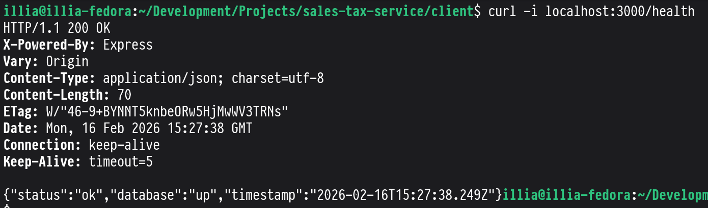
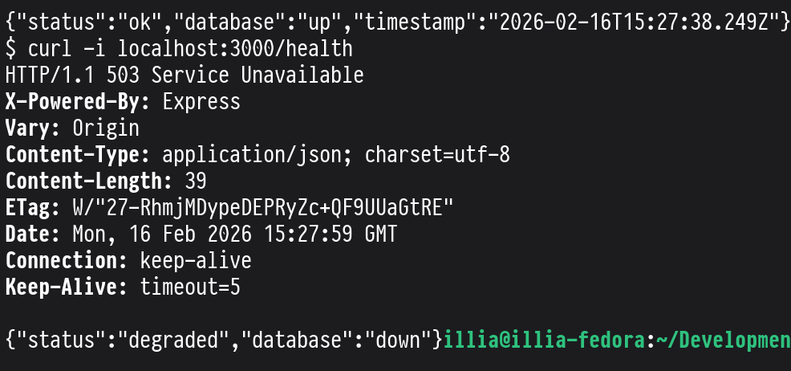
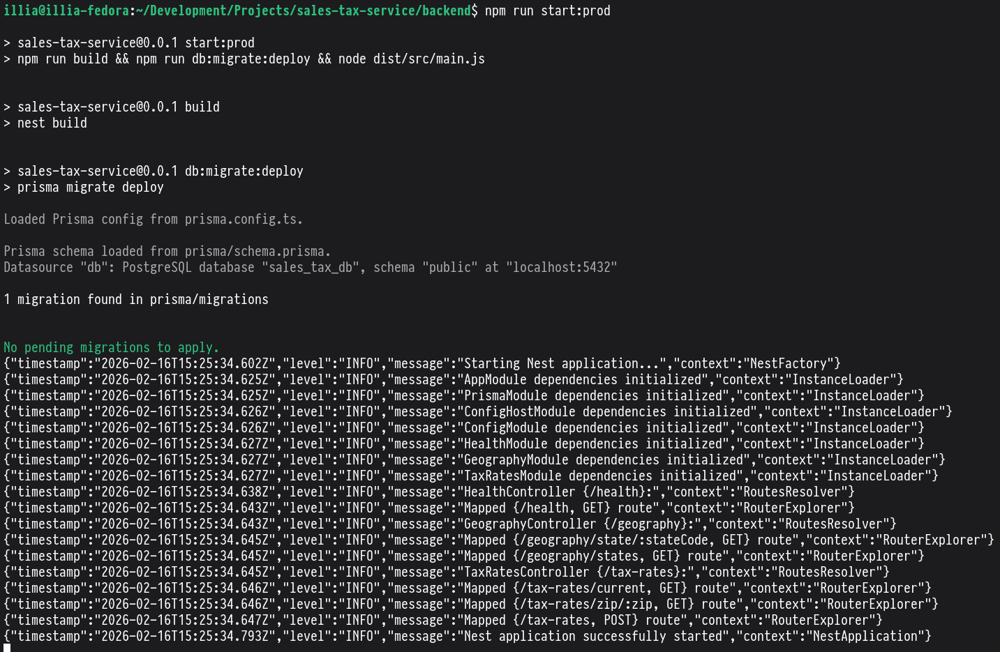
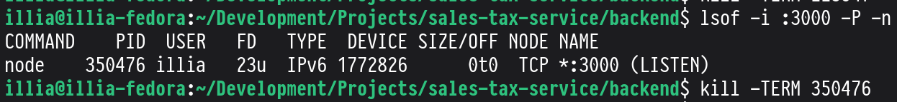
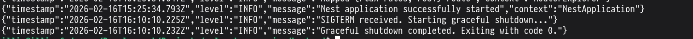

# Sales Tax Service

Sales Tax Service is a full-stack application for US sales tax lookup and tax-rate management.
It includes a NestJS + Prisma backend (ZIP-based tax calculation, versioned rates, health checks, JSON logging, graceful shutdown) and a Next.js frontend for geography browsing, tax lookup, current rates view, and admin rate configuration.

## Configuration

## Run the application

### 1) Start backend first

```bash
cd backend
npm install
docker compose up -d
npm run start:dev
```

Backend runs on `http://localhost:3000`.

### 2) Start frontend second

```bash
cd client
npm install
npm run dev
```

Frontend runs on `http://localhost:3001`.

### Required environment variables

#### Backend (`backend/.env`)

- `DB_HOST` - PostgreSQL host (for local run: `localhost`)
- `DB_PORT` - PostgreSQL port (for local run: `5432`)
- `DB_NAME` - PostgreSQL database name
- `DB_USER` - PostgreSQL user
- `DB_PASSWORD` - PostgreSQL password
- `ADMIN_API_KEY` - API key for admin-only endpoints
- `PORT` - backend HTTP server port
- `CORS_ORIGIN` - allowed frontend origin (example: `http://localhost:3001`)

#### Frontend (`client/.env.local`)

- `NEXT_PUBLIC_API_BASE_URL` - backend base URL used in browser requests (example: `http://localhost:3000`)

#### Optional frontend server-side variable

- `API_BASE_URL` - backend base URL for Next.js server-side routes (if unset, server-side code uses `NEXT_PUBLIC_API_BASE_URL`)

## Health Check Confirmation

### `GET /health` returns `200` when DB is connected



### `GET /health` returns `503` when DB is stopped



## Example JSON Logs (startup)

```bash
{"timestamp":"2026-02-16T17:20:40.112Z","level":"INFO","message":"Starting Nest application...","context":"NestFactory"}
{"timestamp":"2026-02-16T17:20:40.169Z","level":"INFO","message":"AppModule dependencies initialized","context":"InstanceLoader"}
{"timestamp":"2026-02-16T17:20:40.173Z","level":"INFO","message":"HealthModule dependencies initialized","context":"InstanceLoader"}
{"timestamp":"2026-02-16T17:20:40.180Z","level":"INFO","message":"Mapped {/health, GET} route","context":"RouterExplorer"}
{"timestamp":"2026-02-16T17:20:40.247Z","level":"INFO","message":"Nest application successfully started","context":"NestApplication"}
```



## Shutdown Confirmation

After sending `kill <pid>` (`SIGTERM`) to the backend process, the application logs graceful shutdown start/completion and exits cleanly.



